<p align="center">
  <a href="https://github.com/ajayreddy8691">
    
  </a>
  <br/>
  
  <br/>
  
</p>

<p align="center">
  <a href="https://github.com/ajayreddy8691?tab=followers"></a>
  <a href="https://github.com/ajayreddy8691?tab=stars"></a>
  <a href="https://www.linkedin.com/in/ajayreddy8691"></a>
  
</p>


## 🖥️ Terminal Boot

```text
┌──[ ajay@data-lab ]──[ ~/profile ]
└─$ cat about.txt

   NAME        : AJAY REDDY
   HANDLE      : @ajayreddy8691
   ROLE        : Data Analyst & Python Developer
   LOCATION    : India 📍
   STATUS      : ● ONLINE - open to collaboration & opportunities
   PROJECTS    : 5 featured end-to-end analyses
   TOOLKIT     : Python, SQL, Pandas, Statsmodels, Plotly, Tableau

┌──[ ajay@data-lab ]──[ ~/profile ]
└─$ ls research_topics/

   healthcare_epidemiology/      geospatial choropleths, pandemic trends
   real_estate_valuation/        OLS hedonic pricing models
   geopolitical_security/        global incident pattern analytics
   wearable_biometrics/          workout vitals, linear mixed models
   fx_quant_backtesting/         strategy engine, risk & return metrics

┌──[ ajay@data-lab ]──[ ~/profile ]
└─$ echo "Curiosity is my primary key." _
```


## 🧭 Architecture Matrix

```text
ajayreddy8691/
│
├── 🩺 HEALTHCARE ANALYTICS
│   └── Covid19_pandamic_analysis
│       └── EDA ──► time-series trends ──► Plotly choropleths
│
├── 🏠 ECONOMETRICS
│   └── cracow_real_estate_pricing
│       └── Cleaning ──► feature engineering ──► OLS hedonic model
│
├── 🌍 GEOPOLITICAL ANALYTICS
│   └── global_terrorism_eda
│       └── Incident data ──► spatial/temporal EDA ──► risk patterns
│
├── ⌚ BIOMETRIC / IoT ANALYTICS
│   └── polar-watch-fitness-analysis
│       └── Wearable vitals ──► repeated measures ──► linear mixed models
│
└── 💹 QUANTITATIVE FINANCE
    └── fx_trading_analysis
        └── Price data ──► signal logic ──► backtest ──► performance metrics
```




```mermaid
flowchart LR
    A[Raw Data] --> B[Cleaning & Validation]
    B --> C[Exploratory Analysis]
    C --> D[Statistical Modeling]
    D --> E[Interactive Visuals]
    E --> F[Decisions & Insight]
    style A fill:#0D1117,stroke:#00F0FF,color:#fff
    style B fill:#0D1117,stroke:#00F0FF,color:#fff
    style C fill:#0D1117,stroke:#FF007F,color:#fff
    style D fill:#0D1117,stroke:#FF007F,color:#fff
    style E fill:#0D1117,stroke:#00FF66,color:#fff
    style F fill:#0D1117,stroke:#00FF66,color:#fff
```

## 🧰 Technical Ecosystem

<h3 align="center">Languages & Core Analytics</h3>
<p align="center">
  
  
  
  
</p>

<h3 align="center">Statistics & Modeling</h3>
<p align="center">
  
  
  
  
</p>

<h3 align="center">Data Visualization</h3>
<p align="center">
  
  
  
  
</p>

<h3 align="center">Workflow & Infrastructure</h3>
<p align="center">
  
  
  
</p>


## 🚀 Featured Portfolio

| # | Project | Domain | Analytical Takeaway |
|:-:|:--------|:-------|:--------------------|
| 1 | [**Covid19_pandamic_analysis**](https://github.com/ajayreddy8691/Covid19_pandamic_analysis) | `Healthcare` `Plotly` | Country-level pandemic trends explored through interactive choropleth maps |
| 2 | [**cracow_real_estate_pricing**](https://github.com/ajayreddy8691/cracow_real_estate_pricing) | `Real Estate` `Econometrics` | Hedonic OLS models that isolate how property features drive price |
| 3 | [**global_terrorism_eda**](https://github.com/ajayreddy8691/global_terrorism_eda) | `Geopolitics` `EDA` | Spatial and temporal patterns in global security incidents |
| 4 | [**polar-watch-fitness-analysis**](https://github.com/ajayreddy8691/polar-watch-fitness-analysis) | `IoT` `Biometrics` | Workout vitals modeled with linear mixed models to handle repeated measures |
| 5 | [**fx_trading_analysis**](https://github.com/ajayreddy8691/fx_trading_analysis) | `FinTech` `Quant` | FX strategy backtesting engine focused on performance and risk evaluation |

<details>
<summary><b>📂 Reference project layout (click to expand)</b></summary>

<br/>

```text
project-root/
├── data/
│   ├── raw/                 # untouched source files
│   └── processed/           # cleaned, analysis-ready datasets
├── notebooks/
│   ├── 01_data_cleaning.ipynb
│   ├── 02_exploratory_analysis.ipynb
│   ├── 03_modeling.ipynb
│   └── 04_visualization.ipynb
├── src/
│   ├── preprocessing.py     # reusable cleaning helpers
│   ├── models.py            # statistical / backtest logic
│   └── plots.py             # shared chart styles
├── reports/
│   └── figures/             # exported charts and maps
├── requirements.txt
└── README.md
```

</details>


## 📊 GitHub Analytics

<p align="center">
  
  
</p>

<p align="center">
  
</p>

<p align="center">
  
</p>


## 🐍 Contribution Snake

<p align="center">
  <picture>
    <source media="(prefers-color-scheme: dark)" srcset="https://raw.githubusercontent.com/ajayreddy8691/ajayreddy8691/output/github-snake-dark.svg" />
    <source media="(prefers-color-scheme: light)" srcset="https://raw.githubusercontent.com/ajayreddy8691/ajayreddy8691/output/github-snake.svg" />
    
  </picture>
</p>


## 🤝 Let's Connect

<p align="center">
  <a href="mailto:ajayreddy8691@gmail.com"></a>
  <a href="https://www.linkedin.com/in/ajayreddy8691"></a>
  <a href="https://github.com/ajayreddy8691"></a>
</p>

<p align="center">
  
</p>

<p align="center"><b>📈 Data tells the story. I make sure it's heard. 📈</b></p>


